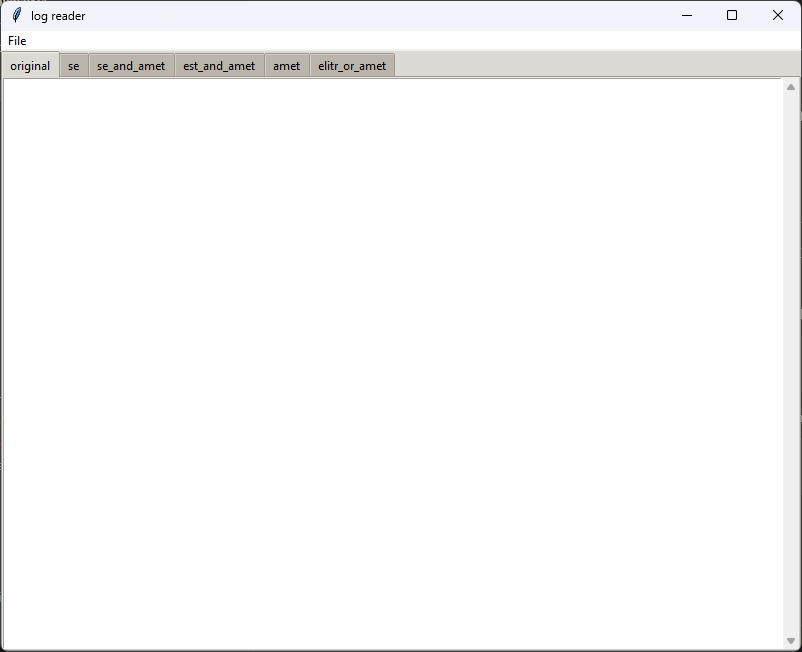
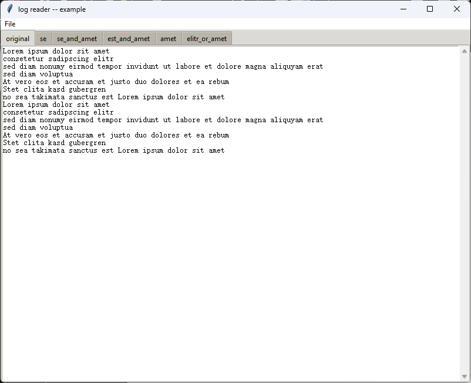
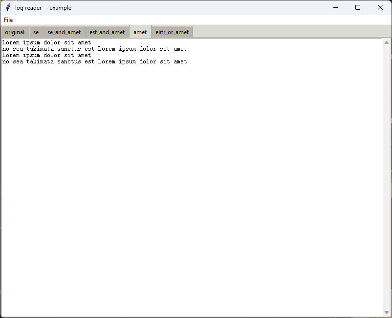

# Log Reader

Do you always need to search for the same keywords in huge log files?

Do you have several editors opened, with similar tabs for filtered log lines with different contents?

I'm tired of this. So make it automatic.

## Usage

1. Create a config.json, if it is not created and the main*.py is executed directly, a the example_config.json will be copied as an examlpe.

2. Run the main script

   a. command line to split a log file into several files (be careful the folder will be cleared)
   ```bash
   python main_cli.py ./example.txt ../test_output
   ```

   b. GUI to view directly without saving (if GUI is not possible, like terminal only or no Tk, main_cli will run but with default parameters)
   ```bash
   python main.py
   ```

      - click File -> Open File to navigate and open one file
      - click File -> Save to save the splitted files to a folder (also the folder will be cleared)
      - with Ctrl+c the texts can be copied, but the texts cannot be edited

# Screenshots

  
